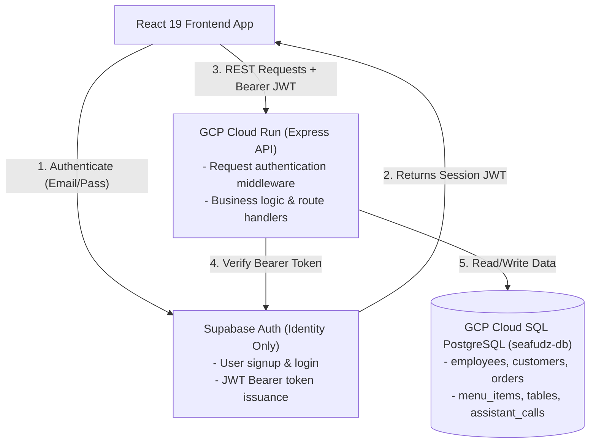
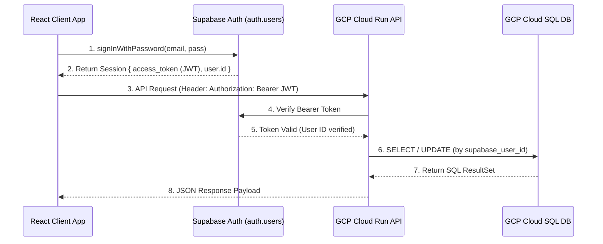
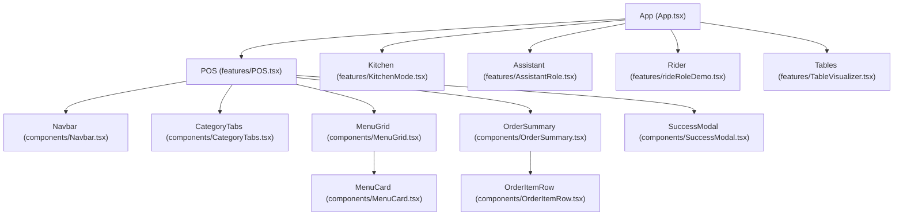

# Architecture Overview - Seafudz ng Bayan

This document describes the architectural layout, component hierarchy, cloud infrastructure, and state management data flow of the **Seafudz ng Bayan** application.

For detailed sequence diagrams and flowcharts, see [DATA_FLOW.md](file:///home/ohmyiu/Documents/Seafudz-ng-Bayan/DATA_FLOW.md).

---

## 📂 Project Directory Structure

The project is structured as a monorepo containing client, backend, and infrastructure definitions:

```text
Seafudz-Ng-Bayan/
├── ARCHITECTURE.md          # System architecture overview
├── DATA_FLOW.md             # Sequence diagrams & data flow documentation
├── gcp_cloudsql_schema.sql  # Production PostgreSQL schema script for GCP Cloud SQL
├── Backend/                 # Express.js REST API Server
│   ├── Dockerfile           # Docker configuration for GCP Cloud Run deployment
│   ├── server.js            # Express server entry point & route initialization
│   └── src/                 # REST controllers, routes & dataset models
└── Frontend/                # Client SPA (React 19, Vite 8, TypeScript 6, Tailwind CSS v4)
    ├── public/              # Static public assets
    ├── src/                 # Application source code
    │   ├── assets/          # Compressed food images & icons
    │   ├── components/      # Reusable presentational components (dumb)
    │   ├── features/        # Multi-role smart containers (POS, KDS, Assistant, Rider)
    │   ├── utils/           # Supabase client helper utilities
    │   ├── App.tsx          # React Router v7 routes definition
    │   └── main.tsx         # Client DOM entry point
    └── vite.config.ts       # Vite bundler & Tailwind CSS v4 plugin config
```

---

## ☁️ Cloud Architecture & Infrastructure Topology

The application operates on a hybrid cloud model splitting authentication and domain data:



---

## 🔄 End-to-End Data Flow Overview



---

## 🏗️ Frontend Architecture & Component Tree

The frontend follows a **"Container-Presentational"** (Smart-Dumb) architectural pattern:
1. **Smart Feature Container (`src/features/`)**: Maintains application state (cart items, active filters, table call resolution, delivery dispatch).
2. **Presentational Components (`src/components/`)**: Render visual UI driven by props and callback events.

### Component Render Tree



---

## 🧮 Financial & VAT Calculations

All transaction values compute reactively:
1. **Subtotal**: Sum of `item.price * item.quantity` across cart items.
2. **VAT (Value Added Tax)**: `Subtotal * 0.12` (12% standard Philippine VAT).
3. **Grand Total**: `Subtotal + VAT`.

---

## 🔗 Related Documentation
- 📄 [DATA_FLOW.md](file:///home/ohmyiu/Documents/Seafudz-ng-Bayan/DATA_FLOW.md): Detailed sequence diagrams for all operational flows.
- 📄 [gcp_cloudsql_schema.sql](file:///home/ohmyiu/Documents/Seafudz-ng-Bayan/gcp_cloudsql_schema.sql): PostgreSQL database DDL script for Cloud SQL.
- 📄 [Backend/Dockerfile](file:///home/ohmyiu/Documents/Seafudz-ng-Bayan/Backend/Dockerfile): Cloud Run container deployment specification.
