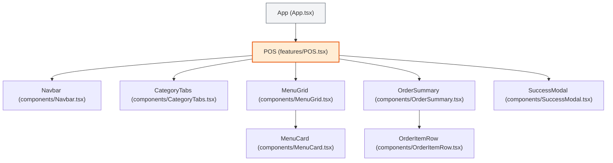
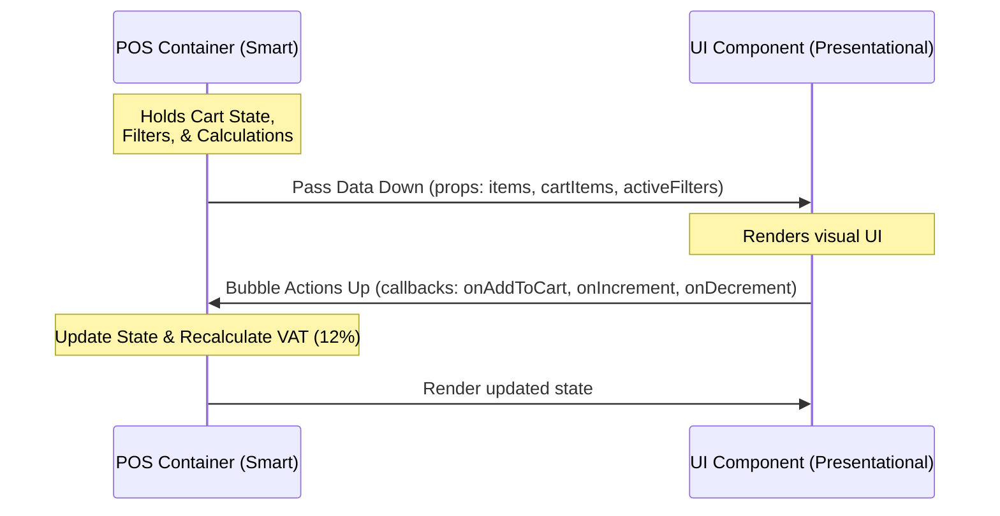

# Architecture Overview - Seafudz ng Bayan

This document describes the architectural layout, component hierarchy, state management data flow, and design system of the **Seafudz ng Bayan** application.

---

## 📂 Project Directory Structure

The project is structured as a monorepo splits into frontend and backend applications:

```text
Seafudz-Ng-Bayan/
├── ARCHITECTURE.md          # This documentation
├── Backend/                 # Server-side application directory (Reserved for APIs)
└── Frontend/                # Client-side SPA (React, Vite, TS, Tailwind CSS v4)
    ├── public/              # Static public assets (Favicon, SVG sprite icons)
    ├── src/                 # Application source code
    │   ├── api/             # Future API request handlers/hooks
    │   ├── assets/          # Static media assets (Food images, logos)
    │   ├── components/      # Reusable presentational components (dumb)
    │   ├── features/        # Orchestrator / Domain containers (smart)
    │   ├── App.tsx          # App root router mount point
    │   ├── main.tsx         # Client entry point (DOM initializer)
    │   └── index.css        # Global CSS entrypoint (Tailwind import)
    ├── vite.config.ts       # Vite bundler & plugin config
    └── tsconfig.json        # TypeScript configuration rules
```

---

## 🏗️ Frontend Architecture & Component Tree

The frontend follows a **"Container-Presentational"** (or Smart-Dumb) architectural pattern:
1. **Smart Feature Container (`src/features/`)**: Renders page layouts, maintains the core application state (cart contents, text queries, selected category filters), and processes actions.
2. **Presentational Components (`src/components/`)**: Receive data through React `props` and emit events using callback functions. They do not maintain state, making them highly testable and reusable.

### Component Render Tree



---

## 🔄 State Management & Data Flow

The application implements a **unidirectional data flow** (Data flows down, Actions flow up):

### Data Flow Pattern



### State Fields (in `POS.tsx`)
- `searchQuery` (`string`): Filters menu items by name or description.
- `selectedCategory` (`string`): Filters menu items by group (`Seafood`, `Shrimp`, `Crab`, `Drinks`).
- `cartItems` (`CartItem[]`): Represents the items currently selected for ordering and their quantities.
- `tableLocation` (`string`): The table assigned to the order (e.g. `"Table 1"`).
- `orderType` (`string`): `"Take Out"` or `"Dine In"`.
- `isSuccessModalOpen` (`boolean`): Controls whether the checkout receipt popup is visible.

---

## 🧮 Reactive Calculations

All calculations in the checkout receipt are derived directly from the application state. When the quantity of items changes, the values update reactively:

1. **Subtotal**: Sum of `item.price * item.quantity` for all items in the cart.
2. **VAT (Value Added Tax)**: Computed as `Subtotal * 0.12` (12% standard Philippine VAT).
3. **Total**: Computed as `Subtotal + VAT`.

---

## 🎨 Styling & Assets

- **Tailwind CSS v4**: Built entirely on top of Tailwind's utility-first compilation. No separate stylesheet files are needed, keeping compilation and performance optimized.
- **Responsive Layout**: Renders as a dual-pane dashboard (Grid on the left, Sidebar on the right) on desktop screen dimensions, and stacks into a single-column layout on mobile devices.
- **Static Assets**: Stored directly in `src/assets/` to be processed and compressed during the production build pipeline.
