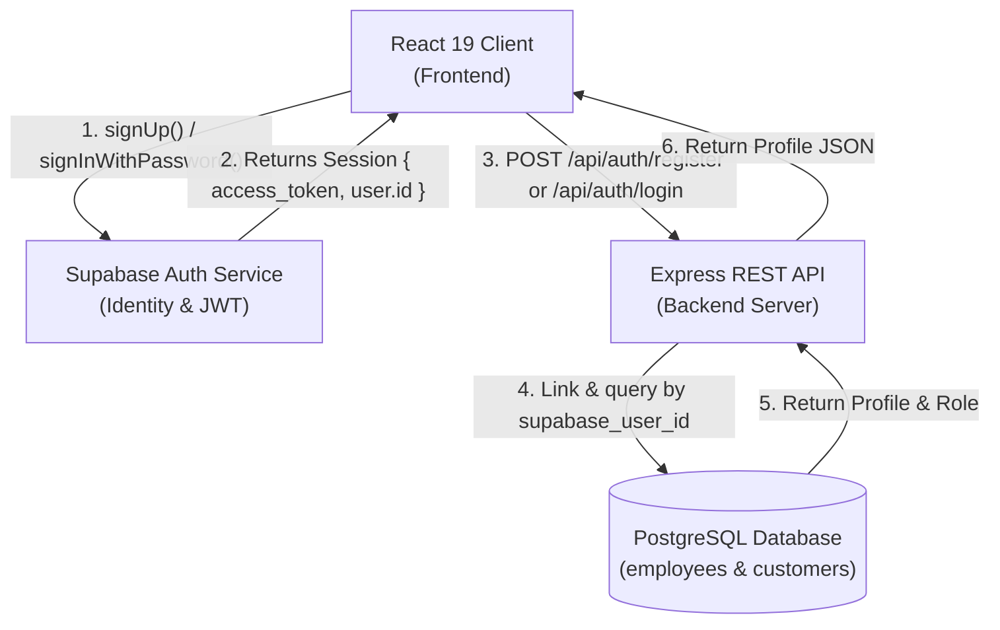

# 🔐 Frontend Auth Setup & Backend Data Connection Guide

A comprehensive, step-by-step guide on how authentication works in **Seafudz ng Bayan**, covering **Supabase Auth** (Identity Provider), the **React 19 Frontend Client**, and the **Express.js / PostgreSQL Backend API**.

---

## 🏛️ System Overview & Architecture

The system uses a **Decoupled Identity Provider Pattern**:

1. **Supabase Auth**: Manages credentials, user signups, logins, password hashing, and issues signed **JWT Access Tokens**.
2. **React 19 Client**: Handles the UI forms, calls Supabase Auth SDK, stores sessions, and attaches `Authorization: Bearer <JWT>` to backend API calls.
3. **Express.js API Backend**: Verifies the Bearer JWT token and provisions/fetches user profiles (`employees` or `customers`) from **PostgreSQL**.



---

## ⚙️ Step 1: Environment Variables Setup

### Frontend Environment (`Frontend/.env`)
Ensure your frontend `.env` contains your Supabase gateway URL and publishable key, plus the backend API endpoint:

```env
VITE_SUPABASE_URL=https://nvtozwvlbjqbujnzafoh.supabase.co
VITE_SUPABASE_PUBLISHABLE_KEY=sb_publishable_mSRd5dUpuEeF0OcFHdSAKg_13Ay72-K
VITE_GCP_API_URL=http://localhost:5000/api
```

### Backend Environment (`Backend/.env`)
Ensure your backend `.env` has the matching Supabase credentials and PostgreSQL connection details:

```env
PORT=5000
NODE_ENV=development

# Supabase Credentials
SUPABASE_URL=https://nvtozwvlbjqbujnzafoh.supabase.co
SUPABASE_ANON_KEY=sb_publishable_mSRd5dUpuEeF0OcFHdSAKg_13Ay72-K

# PostgreSQL Connection Details (Docker Local)
DB_HOST=localhost
DB_PORT=5433
DB_USER=postgres
DB_PASSWORD=postgrespassword
DB_NAME=seafudz_db
```

---

## 🗄️ Step 2: Database Prerequisites

Make sure local PostgreSQL is running:

```bash
docker compose up -d
```

The database schema ([`gcp_cloudsql_schema.sql`](file:///home/ohmyiu/Documents/Seafudz-ng-Bayan/gcp_cloudsql_schema.sql)) links Supabase Auth IDs via the `supabase_user_id` column:

```sql
-- EMPLOYEES TABLE (Staff profiles)
CREATE TABLE employees (
    id UUID PRIMARY KEY DEFAULT gen_random_uuid(),
    supabase_user_id UUID UNIQUE, -- Foreign reference to Supabase auth.users(id)
    fullname VARCHAR(255) NOT NULL,
    username VARCHAR(100) UNIQUE NOT NULL,
    email VARCHAR(255) UNIQUE NOT NULL,
    pin_code VARCHAR(10),
    role VARCHAR(50) NOT NULL CHECK (role IN ('admin', 'manager', 'cashier', 'kitchen', 'rider', 'assistant'))
);

-- CUSTOMERS TABLE (Buyer profiles)
CREATE TABLE customers (
    id UUID PRIMARY KEY DEFAULT gen_random_uuid(),
    supabase_user_id UUID UNIQUE, -- Foreign reference to Supabase auth.users(id)
    fullname VARCHAR(255) NOT NULL,
    email VARCHAR(255) UNIQUE,
    phone VARCHAR(50),
    delivery_address TEXT
);
```

---

## 💻 Step 3: Frontend Client Configuration

### 1. Supabase Client (`Frontend/src/utils/supabase.ts`)
```typescript
import { createClient } from '@supabase/supabase-js';

const supabaseUrl = import.meta.env.VITE_SUPABASE_URL;
const supabaseKey = import.meta.env.VITE_SUPABASE_PUBLISHABLE_KEY;

export const supabase = createClient(supabaseUrl, supabaseKey);
```

### 2. API Helper with Auth Headers (`Frontend/src/utils/api.ts`)
```typescript
import { supabase } from './supabase';

export const API_BASE_URL = import.meta.env.VITE_GCP_API_URL || 'http://localhost:5000/api';

/**
 * Returns Authorization header with Supabase Bearer JWT token if user is logged in
 */
export async function getAuthHeaders(extraHeaders: Record<string, string> = {}): Promise<HeadersInit> {
  const headers: Record<string, string> = {
    'Content-Type': 'application/json',
    ...extraHeaders,
  };

  try {
    const { data } = await supabase.auth.getSession();
    const token = data.session?.access_token;
    if (token) {
      headers['Authorization'] = `Bearer ${token}`;
    }
  } catch (err) {
    console.warn('Failed to retrieve Supabase auth token:', err);
  }

  return headers;
}
```

---

## 📝 Step 4: User Registration Flow

When a new user signs up in [`Frontend/src/features/Login.tsx`](file:///home/ohmyiu/Documents/Seafudz-ng-Bayan/Frontend/src/features/Login.tsx):

1. **Step A**: Call `supabase.auth.signUp()` to register credentials in Supabase.
2. **Step B**: Take the generated `supabaseUserId` and post the profile data to Express backend `POST /api/auth/register`.

```typescript
const handleRegister = async (e: React.FormEvent) => {
  e.preventDefault();

  // 1. Create account in Supabase Auth Provider
  const { data: authData, error: authError } = await supabase.auth.signUp({
    email: email,
    password: password,
  });

  if (authError) throw new Error(authError.message);

  const supabaseUserId = authData.user?.id;

  // 2. Register profile in PostgreSQL Express Backend
  const res = await fetch(`${API_BASE_URL}/auth/register`, {
    method: 'POST',
    headers: { 'Content-Type': 'application/json' },
    body: JSON.stringify({
      supabaseUserId,
      fullname,
      username,
      email,
      role, // 'customer', 'cashier', 'kitchen', 'rider', 'assistant'
      token: verificationCode, // Business access token: 'SFB-STAFF-99' for staff
    }),
  });

  const resData = await res.json();
  if (!res.ok) throw new Error(resData.message);

  // Navigate user to their respective role dashboard
  navigateByRole(role);
};
```

---

## 🔑 Step 5: User Login Flow

When an existing user logs in:

1. **Step A**: Attempt `supabase.auth.signInWithPassword({ email, password })`.
2. **Step B**: Call Express backend `POST /api/auth/login` with `supabaseUserId` or `username`/`email`.
3. **Step C**: Redirect user based on their assigned role:

```typescript
const handleLogin = async (e: React.FormEvent) => {
  e.preventDefault();
  const isEmail = loginInput.includes('@');

  // 1. Authenticate with Supabase Auth
  let supabaseUser = null;
  if (isEmail) {
    const { data, error } = await supabase.auth.signInWithPassword({
      email: loginInput,
      password: loginPassword,
    });
    if (data?.user) supabaseUser = data.user;
  }

  // 2. Retrieve employee/customer profile from Express Backend
  const res = await fetch(`${API_BASE_URL}/auth/login`, {
    method: 'POST',
    headers: { 'Content-Type': 'application/json' },
    body: JSON.stringify({
      email: isEmail ? loginInput : undefined,
      username: !isEmail ? loginInput : undefined,
      pinCode: !isEmail ? loginPassword : undefined,
      supabaseUserId: supabaseUser?.id,
    }),
  });

  const profileData = await res.json();
  const userRole = profileData.data?.role || 'customer';

  // Role-based Navigation
  if (userRole === 'cashier') navigate('/sales-report');
  else if (userRole === 'kitchen') navigate('/kitchen');
  else if (userRole === 'rider') navigate('/rider');
  else if (userRole === 'assistant') navigate('/assistant');
  else navigate('/customer');
};
```

---

## 🛡️ Step 6: Backend Token Verification & Protection

Protected Express routes use [`Backend/src/middleware/authMiddleware.js`](file:///home/ohmyiu/Documents/Seafudz-ng-Bayan/Backend/src/middleware/authMiddleware.js):

```javascript
import { requireAuth } from '../middleware/authMiddleware.js';

// GET /api/auth/me - Protected Route
router.get('/auth/me', requireAuth, async (req, res) => {
  // req.user contains the authenticated profile from PostgreSQL!
  return res.status(200).json({
    success: true,
    data: req.user,
  });
});
```

How `requireAuth` works under the hood:
1. Extracts `Authorization: Bearer <token>` from HTTP request headers.
2. Calls `supabase.auth.getUser(token)` to verify the JWT signature.
3. Queries `SELECT * FROM employees WHERE supabase_user_id = user.id` (or `customers`).
4. Attaches `req.user` to Express request object and calls `next()`.

---

## 💡 Troubleshooting & Gotchas

| Issue | Cause | Solution |
| :--- | :--- | :--- |
| `Email rate limit exceeded` | Default Supabase free tier email limit hit during testing. | Go to Supabase Dashboard → **Authentication** → **Providers** → **Email** → Toggle OFF **"Confirm email"**. |
| `ECONNREFUSED 127.0.0.1:5433` | Local PostgreSQL Docker container is not running. | Run `docker compose up -d` in project root. |
| `Port 5000 is already in use` | An existing Node process is listening on port 5000. | Run `fuser -k 5000/tcp` to free port 5000. |
| `Access Denied: Invalid Employee Access Token` | Registering for staff role (`cashier`, `kitchen`, etc.) without token. | Enter access token `SFB-STAFF-99` when selecting staff role. |
