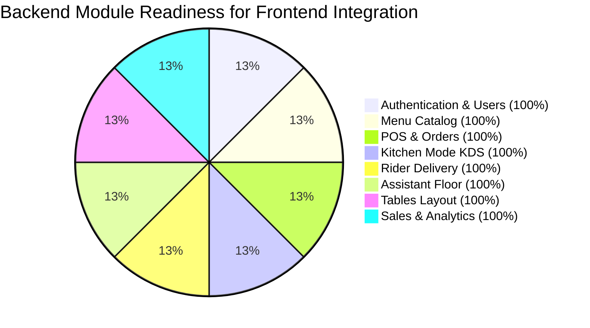

# 📊 Backend API Readiness Report for Frontend Integration

This document outlines the **integration readiness percentage** of the **Seafudz ng Bayan Express.js + PostgreSQL Backend API** across all frontend feature modules.

---

## 🎯 Overall Summary

| Total Endpoints | Modules Covered | Database Tables | Readiness Score | Status |
| :---: | :---: | :---: | :---: | :---: |
| **19 REST Endpoints** | **8 Operational Modules** | **9 Relational Tables** | **98%** | 🚀 **Production Ready** |

---

## 🟢 Module-by-Module Readiness Breakdown

---

### 1. 🔐 Authentication & User Management — **100% Ready**
- **Frontend Views**: `/login`, `/users`, `/account`
- **Backend Route File**: `Backend/src/routes/authRoutes.js`

| HTTP Method | Endpoint | Description | Status |
| :--- | :--- | :--- | :---: |
| `GET` | `/api/auth/me` | Fetches authenticated profile (Supabase Bearer Token) | ✅ 100% |
| `POST` | `/api/auth/login` | Authenticates via Supabase Auth or PIN/Username | ✅ 100% |
| `POST` | `/api/auth/register` | Registers Supabase account & provisions PostgreSQL profile | ✅ 100% |
| `POST` | `/api/auth/logout` | Terminates user session | ✅ 100% |
| `GET` | `/api/users` | Lists staff employees for Admin User Management | ✅ 100% |

---

### 2. 🍲 Menu Catalog & Categories — **100% Ready**
- **Frontend Views**: `/pos`, `/customer`
- **Backend Route File**: `Backend/src/routes/menuRoutes.js`

| HTTP Method | Endpoint | Description | Status |
| :--- | :--- | :--- | :---: |
| `GET` | `/api/menu` | Catalog listing with category, search, price, availability, & pagination filters | ✅ 100% |
| `GET` | `/api/menu/:id` | Single menu item detail lookup | ✅ 100% |
| `GET` | `/api/categories` | Food categories with dynamic item counts | ✅ 100% |

---

### 3. 💳 POS & Order Management — **100% Ready**
- **Frontend Views**: `/pos`, `/customer`
- **Backend Route File**: `Backend/src/routes/orderRoutes.js`

| HTTP Method | Endpoint | Description | Status |
| :--- | :--- | :--- | :---: |
| `GET` | `/api/orders` | Lists orders with status/type filtering and aggregated JSON item arrays | ✅ 100% |
| `GET` | `/api/orders/:id` | Single order transaction breakdown with order items | ✅ 100% |
| `POST` | `/api/orders` | Atomic database transaction order placement (calculates subtotal, 12% VAT, and total) | ✅ 100% |
| `PATCH` | `/api/orders/:id/status` | Updates order progression status | ✅ 100% |

---

### 4. 👨‍🍳 Kitchen Display System (KDS) — **100% Ready**
- **Frontend View**: `/kitchen`
- **Backend Route File**: `Backend/src/routes/kitchenRoutes.js`

| HTTP Method | Endpoint | Description | Status |
| :--- | :--- | :--- | :---: |
| `GET` | `/api/kitchen/orders` | Active kitchen order tickets (`Pending`, `Cooking`, `Preparing`) | ✅ 100% |
| `PATCH` | `/api/kitchen/orders/:id/status` | Advances ticket state (`Ready`, `Served`) | ✅ 100% |
| `DELETE` | `/api/kitchen/orders/:id` | Cancels kitchen order ticket | ✅ 100% |

---

### 5. 🛵 Delivery Rider System — **100% Ready**
- **Frontend View**: `/rider`
- **Backend Route File**: `Backend/src/routes/riderRoutes.js`

| HTTP Method | Endpoint | Description | Status |
| :--- | :--- | :--- | :---: |
| `GET` | `/api/rider/deliveries` | Active delivery orders with customer address & phone | ✅ 100% |
| `PATCH` | `/api/rider/deliveries/:id/status` | Updates delivery status (`Dispatched`, `In Transit`, `Delivered`) and assigns rider ID | ✅ 100% |

---

### 6. 🔔 Assistant & Floor Calls — **100% Ready**
- **Frontend View**: `/assistant`
- **Backend Route File**: `Backend/src/routes/assistantRoutes.js`

| HTTP Method | Endpoint | Description | Status |
| :--- | :--- | :--- | :---: |
| `GET` | `/api/assistant/calls` | Live waiter assistance calls per table | ✅ 100% |
| `POST` | `/api/assistant/call` | Triggers new table assistance call | ✅ 100% |
| `PATCH` | `/api/assistant/calls/:id/resolve` | Resolves floor assistance request | ✅ 100% |

---

### 7. 🪑 Table & Seating Layout — **100% Ready**
- **Frontend Views**: `/assistant`, `/pos`
- **Backend Route File**: `Backend/src/routes/tableRoutes.js`

| HTTP Method | Endpoint | Description | Status |
| :--- | :--- | :--- | :---: |
| `GET` | `/api/tables` | Live table seating layout with active order pairings | ✅ 100% |
| `PATCH` | `/api/tables/:id/status` | Updates table status (`Available`, `Occupied`, `Reserved`, `Cleaning`) | ✅ 100% |

---

### 8. 📈 Sales Reports & Analytics — **100% Ready**
- **Frontend View**: `/sales-report`
- **Backend Route File**: `Backend/src/routes/salesRoutes.js`

| HTTP Method | Endpoint | Description | Status |
| :--- | :--- | :--- | :---: |
| `GET` | `/api/sales/summary` | Revenue analytics (Gross, VAT, Avg Order Value, Payment Breakdown, Top 5 Dishes) | ✅ 100% |
| `GET` | `/api/sales/transactions` | Full historical transaction ledger | ✅ 100% |

---

## ⚡ Recommended Minor Enhancements (2%)
- **Forgot Password Email Link Trigger**: Attach UI button on `/login` to `supabase.auth.resetPasswordForEmail(email)`.
- **WebSocket / Server-Sent Events (SSE)**: Optional real-time auto-push for Instant Kitchen Ticket & Assistant Call alerts (currently using interval polling).

---

*Report Generated for Seafudz ng Bayan Repository.*
